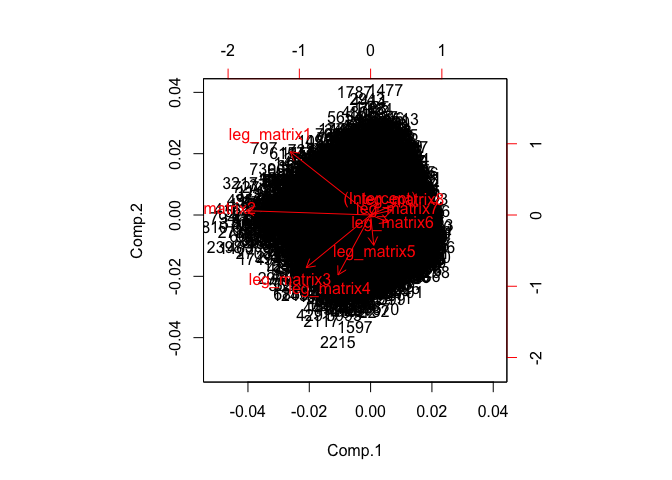
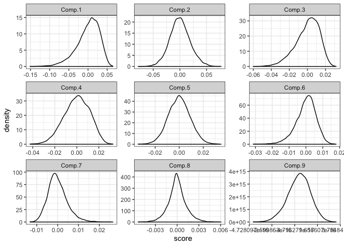
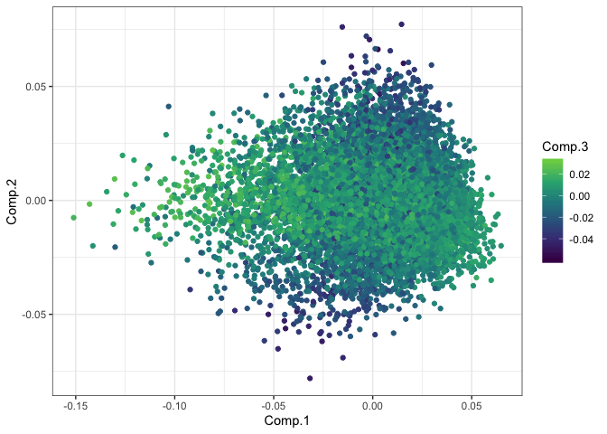

Mapping FS space
================

``` r
knitr::opts_chunk$set(echo = FALSE)
library(dplyr)
```

    ## 
    ## Attaching package: 'dplyr'

    ## The following objects are masked from 'package:stats':
    ## 
    ##     filter, lag

    ## The following objects are masked from 'package:base':
    ## 
    ##     intersect, setdiff, setequal, union

``` r
library(scads)
library(ggplot2)
dataset <- "large"
```

    ## Loading in data version 1.127.0

This report is for Portal control rodents 1990=95, 10000 draws.
===============================================================

Density plots of raw rank abundances
------------------------------------

The y-axes are abundance (on the left) and relative abundance (on the right). Each black dot is an abundance value from a vector drawn from the feasible set. The red line plots the distribution from Portal.

The black dots are semi-transparent, which makes it a little easier to see the density distribution.

The rescaled vectors (on the right) are what go into Legendre approximation. In this case, these plots should look identical, because all the draws from the feasible set have the same number of individuals as the Portal vector. I have at other times compared SADs without the total abundance constraint, where the rescaled plots could look quite different.


    ## Loading required package: polynom


They look quasi-normal?

    ## Importance of components:
    ##                            Comp.1     Comp.2     Comp.3     Comp.4
    ## Standard deviation     0.02971886 0.01894397 0.01303496 0.01153497
    ## Proportion of Variance 0.52363862 0.21276947 0.10073650 0.07888613
    ## Cumulative Proportion  0.52363862 0.73640809 0.83714459 0.91603073
    ##                            Comp.5      Comp.6      Comp.7       Comp.8
    ## Standard deviation     0.00910269 0.005964187 0.004656327 0.0012318314
    ## Proportion of Variance 0.04912549 0.021089671 0.012854471 0.0008996424
    ## Cumulative Proportion  0.96515622 0.986245886 0.999100358 1.0000000000
    ##                        Comp.9
    ## Standard deviation          0
    ## Proportion of Variance      0
    ## Cumulative Proportion       1



    ##            Comp.1       Comp.2       Comp.3       Comp.4       Comp.5
    ## [1,] -0.076780194 -0.033566800 -0.014374551 -0.015099103 -0.006004817
    ## [2,] -0.074006909 -0.006250084 -0.004391511  0.001809231 -0.016265286
    ## [3,] -0.023849416  0.024085361 -0.019188135 -0.006373632 -0.008319252
    ## [4,] -0.010387022  0.029021684 -0.011670617 -0.002194681 -0.016708488
    ## [5,] -0.003837996 -0.008407698  0.027156364 -0.003904943  0.003933805
    ## [6,] -0.067206062 -0.013188066  0.001725041 -0.010094577 -0.018502658
    ##            Comp.6        Comp.7        Comp.8        Comp.9
    ## [1,] -0.005678202 -0.0004552401  1.010171e-04 -5.030698e-17
    ## [2,] -0.005307743 -0.0042780198  1.305746e-04  4.396440e-17
    ## [3,] -0.001384534 -0.0002268695 -7.155119e-05  5.117434e-17
    ## [4,] -0.002308439 -0.0029835383  1.829185e-05  8.413409e-17
    ## [5,] -0.025134778  0.0071827117  6.810035e-05 -1.647987e-16
    ## [6,]  0.004963792 -0.0007495581 -1.997334e-04  1.413800e-16




