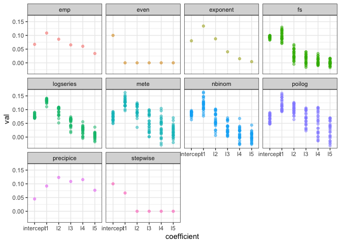

Legendre approx vs. functions
================

``` r
knitr::opts_chunk$set(echo = FALSE)
library(ggplot2)
library(meteR)
library(dplyr)
```

    ## 
    ## Attaching package: 'dplyr'

    ## The following objects are masked from 'package:stats':
    ## 
    ##     filter, lag

    ## The following objects are masked from 'package:base':
    ## 
    ##     intersect, setdiff, setequal, union

``` r
library(scads)

set.seed(1977)
nsamples <- 25
```

    ## Loading in data version 1.90.0

    ## Warning in bind_rows_(x, .id): binding factor and character vector,
    ## coercing into character vector

    ## Warning in bind_rows_(x, .id): binding character and factor vector,
    ## coercing into character vector

    ## Warning in bind_rows_(x, .id): binding character and factor vector,
    ## coercing into character vector

    ## Warning in bind_rows_(x, .id): binding character and factor vector,
    ## coercing into character vector

    ## Warning in bind_rows_(x, .id): binding character and factor vector,
    ## coercing into character vector

    ## Warning in bind_rows_(x, .id): binding character and factor vector,
    ## coercing into character vector

### Raw rank abundance curves


### Sum of squared errors vs. number of polynomials used

    ## Loading required package: polynom

 \#\#\# Fitted coefficients




