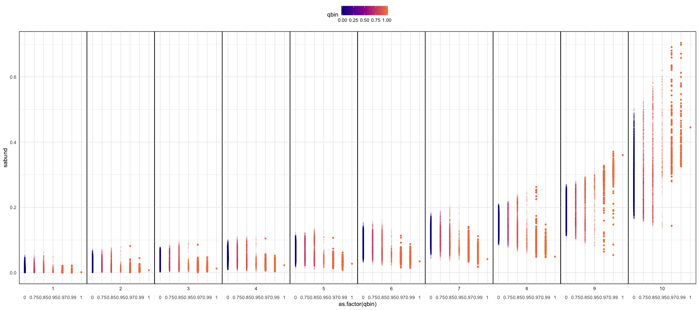
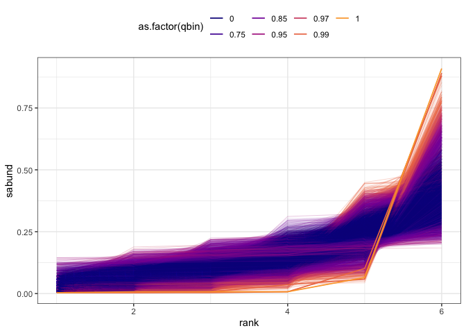

Mapping FS space
================

``` r
library(dplyr)
```

    ## 
    ## Attaching package: 'dplyr'

    ## The following objects are masked from 'package:stats':
    ## 
    ##     filter, lag

    ## The following objects are masked from 'package:base':
    ## 
    ##     intersect, setdiff, setequal, union

``` r
library(scads)
library(ggplot2)
small = F
knitr::opts_chunk$set(echo = FALSE)
```

    ## Loading in data version 1.127.0


The rescaled vectors (on the right) are what go into Legendre approximation. In this case, these plots should look identical, because all the draws from the feasible set have the same number of individuals as the Portal vector. I have at other times compared SADs without the total abundance constraint, where the rescaled plots could look quite different.

    ## Loading required package: polynom


The green line marks the centroid, and the red line marks the Portal estimation values.

    ## Warning: Removed 1 rows containing missing values (geom_point).


Here we are reconstructing the scaled SAD from the approximated coefficients. The hollow points are estimates from approximation with 8 polynomials, and the stars mark the true values. Using 8 polynomials for a 10-species vector gives us extremely low SSQE. There is no real value for the centroid, but `closest_fs` is the element of the feasible set with the lowest euclidean distance between its coefficients and the centroid coefficients.







