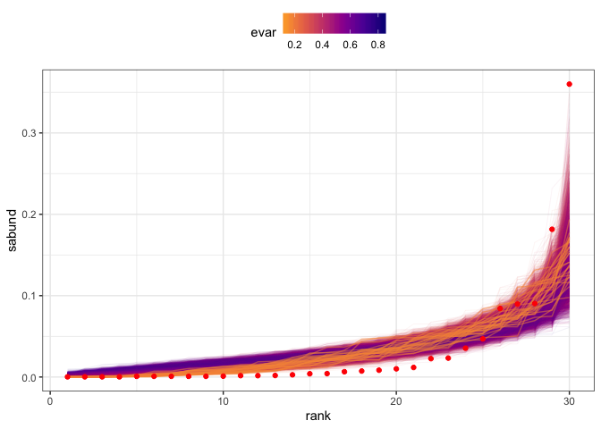

Mapping FS space
================

``` r
knitr::opts_chunk$set(echo = FALSE)
library(dplyr)
library(scads)
library(ggplot2)
dataset <- "plants"
```

    ## Loading in data version 1.127.0

This report is for Portal winter annuals 1994, 10000 draws.
===========================================================

Density plots of raw rank abundances
------------------------------------

The y-axes are abundance (on the left) and relative abundance (on the right). Each black dot is an abundance value from a vector drawn from the feasible set. The red line plots the distribution from Portal.

The black dots are semi-transparent, which makes it a little easier to see the density distribution.

The rescaled vectors (on the right) are what go into Legendre approximation. In this case, these plots should look identical, because all the draws from the feasible set have the same number of individuals as the Portal vector. I have at other times compared SADs without the total abundance constraint, where the rescaled plots could look quite different.


Density plots of coeffiients from Legendre approximation
--------------------------------------------------------

The y-axis is the value of the coefficient for each Legendre polynomial. Each black dot is a value for a draw from the feasible set.

The green line marks the centroid of the coefficients for the draws from the feasible set. The red line marks the coefficients for the Portal vector.


True values compared to estimations via Legendre coefficients
-------------------------------------------------------------

Here we are reconstructing the scaled SAD from the approximated coefficients. The y-axis is the scaled abundance or estimated scaled abundance. The hollow points are estimates from approximation with 10 polynomials, and the stars are the true values.

There is no true value for the centroid, but `closest_fs` is the element of the feasible set with the lowest euclidean distance between its coefficients and the centroid coefficients. `farthest_fs` is the element of the feasible set with the largest distance between its coefficients and the centroid coefficients.

    ## Warning: Removed 2 rows containing missing values (geom_point).

    ## Warning: Removed 1 rows containing missing values (geom_point).


Distribution of coefficient distances from the centroid
-------------------------------------------------------

Violin/density plot of the Euclidean distance between the centroid coefficients and the coefficients for draws from the feasible set. The violin is for all draws from the feasible set. The black dots are individual draws. The colored dots are for the closest and farthest (from the centroid) elements of the feasible set, and for Portal.


Heat map of RADs, shaded by distance to the centroid
----------------------------------------------------

The y axis is scaled abundance. Each line marks one draw from the feasible set. The colors (`qbin`) map the percentile of the *Euclidean distance between the draw's coefficients and the centroid of the coefficients*. Purpley-pink colors are closer to the centroid; orange to yellow are far. The 3 farthest draws are marked with thicker and less transparent lines. The red dots are the values from Portal.


Heat map of coefficients, shaded by distance to the centroid
------------------------------------------------------------

The y-axis is coefficient values, and the x axis is each coefficient. As above, each line marks the coefficients for a single draw, and lines are shaded according to the distance to the centroid. The red dots are the coefficients for Portal.


Comparing coefficients centroid to abundance centroid
-----------------------------------------------------

It seems possible that the Legendre coefficients might just reproduce the same information that is in the abundance values. So I calculated a few things based on the centroid *of the scaled abundance values* rather than the centroid of the coefficients.

### Prediction from centroid coefficient vs. centroid of abundance values

The yellow line is the centroid *of the scaled abundance values* (not the coefficients). The estimate from the centroid of the coefficients (black line and points) almost exactly matches.


### Distances calculated from coefficient centroid vs abundance centroid

Each dot is draw from the feasible set. The x axis is the distance from the centroid of the abundance values. The y axis is the distance from the centroid of the coefficients. The yellow line is 1:1. The centroid values are generally smaller than the abundance values.


### Rank distance calculated from coefficient centroid vs abundance centroid

Each dot is draw from the feasible set. The x axis is the rank of a draw's distance from the centroid of the abundance values. The y axis is the rank of that draw's distance from the centroid of the coefficients. The yellow line is 1:1. There's a relationship, but a *lot* of scatter.


Comparing coefficient distance to other metrics
-----------------------------------------------

Do the coefficients, or the coefficient-centroid distances, recapitulate more longstanding metrics? I tried evar and skewness.

### Evar

Higher values indicate more even vectors; note the color scale is reversed. (Based on exploration, I expect lower evenness values to be at the edges). The red dots are the Portal vector. `evar` for the Portal vector is 0.140741.



### Skewness

#### Skewness - abundance

The y axis is abundance; colors correspond to skewness. The most and least skewed vectors are highlighted with thicker, less transparent lines. The red dots mark the Portal vector. 

#### Coefficients-skew plot

The y axis is the coefficient values; colors correspond to skewness with the most and least skewed vectors highlighted. The red dots mark the Portal coefficients.


There seems to be some relationship to skewness - skewness locates you in a particular part of the state space. I'm not sure what that means....

#### Comparing skewness to distance from centroid

The x axis is skewness and the y axis is the distance of the coefficients to the centroid. Each dot is a draw from the feasible set.


#### Comparing rank skewness to rank distance from centroid

The x axis is a vector's ranked skewness and the y axis is the ranked distance of the coefficients to the centroid. Each dot is a draw from the feasible set. The orange line is the 1:1 line.


#### Comparing distribution of skewness values to distance values

The red dot on the skewness plot is Portal.


Skewness is not equivalent to centroid distance.

Portal is *very* skewed compared to the bulk of the feasible set. Portal's skewness is 3.1667046, which is more skewed than 98.77% of the feasible set.
