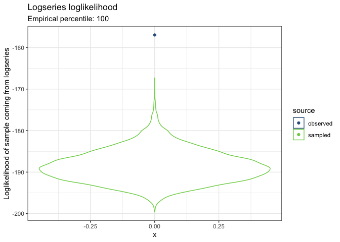
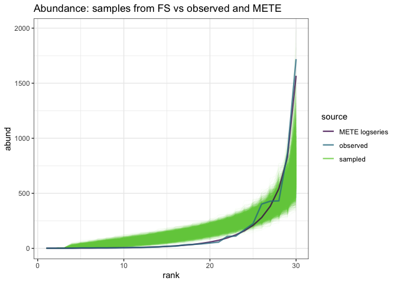

Mapping FS space
================

``` r
knitr::opts_chunk$set(echo = FALSE)
library(dplyr)
```

    ## 
    ## Attaching package: 'dplyr'

    ## The following objects are masked from 'package:stats':
    ## 
    ##     filter, lag

    ## The following objects are masked from 'package:base':
    ## 
    ##     intersect, setdiff, setequal, union

``` r
library(scads)
library(ggplot2)
dataset <- "plants"
```

    ## Loading in data version 1.127.0

This report is for Portal winter annuals 1994, 10000 draws.
===========================================================

Density plots of raw rank abundances
------------------------------------

The y-axes are abundance (on the left) and relative abundance (on the right). Each black dot is an abundance value from a vector drawn from the feasible set. The red line plots the distribution from Portal.

The black dots are semi-transparent, which makes it a little easier to see the density distribution.


MaxEnt (Fisher logseries)
-------------------------

What is the likelihood of the empirical vector coming from the best fit log series compared to the likelihood of the FS samples coming from that logseries?



So for this example, the empirical has a higher likelihood of coming from the METE prediction (Fisher logseries, which can be parameterized using S and N) than `100`% of the feasible set. I *think* this means the predicted distribution is predicting information over and above the general shape forced by the feasible set. But I would like as many nth opinions as I can get.

Poilog
------


Negative binomial
-----------------


So I'm unsure if it's more appropriate to use the same parameters for the loglikelihood of the FS samples vs the empirical ones; I can see an argument for comparing each element to *its* parameters of best fit. Especially given that, for this example at least, *all* the distributions perform very well. This analysis is generous in that direction, and I would like to know if a more strict test would concur.

The METE one is most compelling, at this stage, because the logseries is fit using only S and N and is therefore the same for the observed and all sampled vectors.
