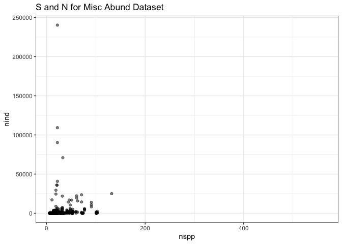
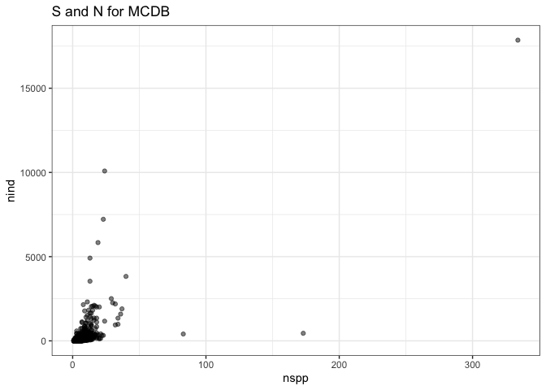
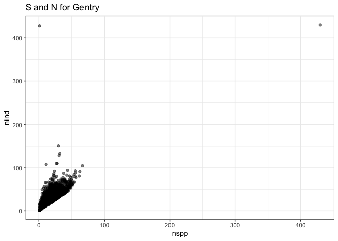

Exploring statevar space
================

Miscellaneous Abundance
=======================

Elita Baldridge's community abundance dataset.

    ## 
    ## Attaching package: 'dplyr'

    ## The following objects are masked from 'package:stats':
    ## 
    ##     filter, lag

    ## The following objects are masked from 'package:base':
    ## 
    ##     intersect, setdiff, setequal, union

    ## [1] "community_abundance_misc_citations"
    ## [2] "community_abundance_misc_main"     
    ## [3] "community_abundance_misc_sites"

    ##    classes family        genus         species relative_abundance
    ## 1 Reptilia           Pituophis       catenifer               0.00
    ## 2 Reptilia        Lampropeltis     calligaster               0.00
    ## 3 Reptilia            Storeria          dekayi               0.00
    ## 4 Reptilia             Eumeces septentrionalis               0.00
    ## 5 Reptilia             Eumeces       obsoletus               0.28
    ## 6 Reptilia              Elaphe          emoryi               1.72
    ##   abundance site_id citation
    ## 1         0       1        1
    ## 2         0       1        1
    ## 3         0       1        1
    ## 4         0       1        1
    ## 5         1       1        1
    ## 6         2       1        1

    ## Warning: Removed 131 rows containing missing values (geom_point).

MCDB
====

Mammal community database

    ## Warning: Removed 1 rows containing missing values (geom_point).

Gentry forest transects
=======================

    ## Warning: Removed 11 rows containing missing values (geom_point).

