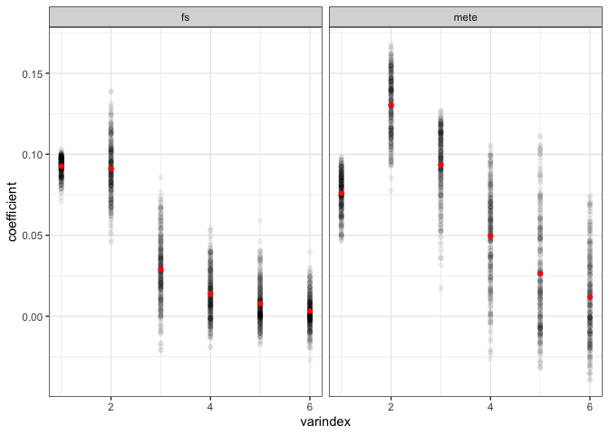
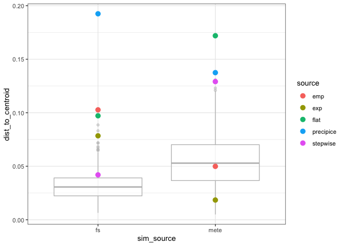

Sensitivity
================
Renata Diaz
8/22/2019

    ## Loading in data version 1.90.0

    ## Warning in bind_rows_(x, .id): binding factor and character vector,
    ## coercing into character vector

    ## Warning in bind_rows_(x, .id): binding character and factor vector,
    ## coercing into character vector

    ## Loading required package: polynom

Centroids
---------

    ## # A tibble: 6 x 5
    ##   sim_source   sim varname     coefficient varindex
    ##   <chr>      <int> <chr>             <dbl>    <int>
    ## 1 mete           1 (Intercept)      0.0928        1
    ## 2 mete           2 (Intercept)      0.0815        1
    ## 3 mete           3 (Intercept)      0.0856        1
    ## 4 mete           4 (Intercept)      0.0515        1
    ## 5 mete           5 (Intercept)      0.0606        1
    ## 6 mete           6 (Intercept)      0.0489        1

