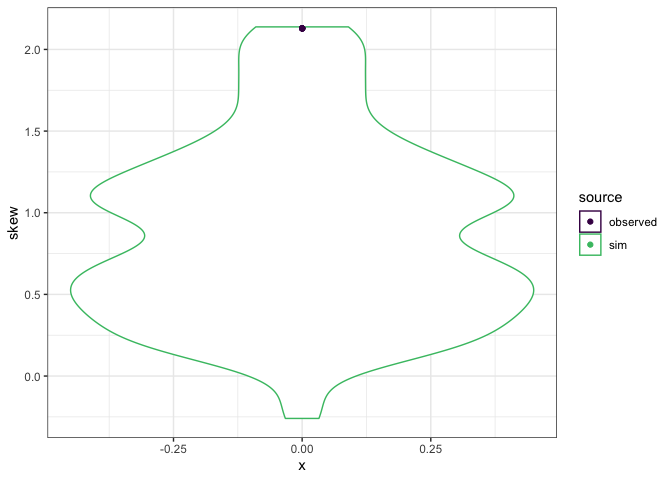

Mapping FS space
================

``` r
knitr::opts_chunk$set(echo = FALSE)
library(dplyr)
```

    ## 
    ## Attaching package: 'dplyr'

    ## The following objects are masked from 'package:stats':
    ## 
    ##     filter, lag

    ## The following objects are masked from 'package:base':
    ## 
    ##     intersect, setdiff, setequal, union

``` r
library(scads)
library(ggplot2)
dataset <- "small"
```

    ## Loading in data version 1.127.0

This report is for Portal control rodents 1990-95, 100 draws.
=============================================================

Density plots of raw rank abundances
------------------------------------

The y-axes are abundance (on the left) and relative abundance (on the right). Each black dot is an abundance value from a vector drawn from the feasible set. The red line plots the distribution from Portal.

The black dots are semi-transparent, which makes it a little easier to see the density distribution.

In this case, these plots should look identical, because all the draws from the feasible set have the same number of individuals as the Portal vector. I have at other times compared SADs without the total abundance constraint, where the rescaled plots could look quite different.




Distance from straight line
---------------------------


Various ways of calculating the amount of concavity (above) look correlated to skewness but not completely...

What are the appropriate rescaling or units?

### Sum squared difference from mean

What does this look like?

### Solving graphically

Usually it will be ((S - (max-min)) / 2) - (N - (S \* min)), but if the vector is not consistently concave (sometimes flat) you can get situations where the sample is above the straight line. It might still be that formula though.
