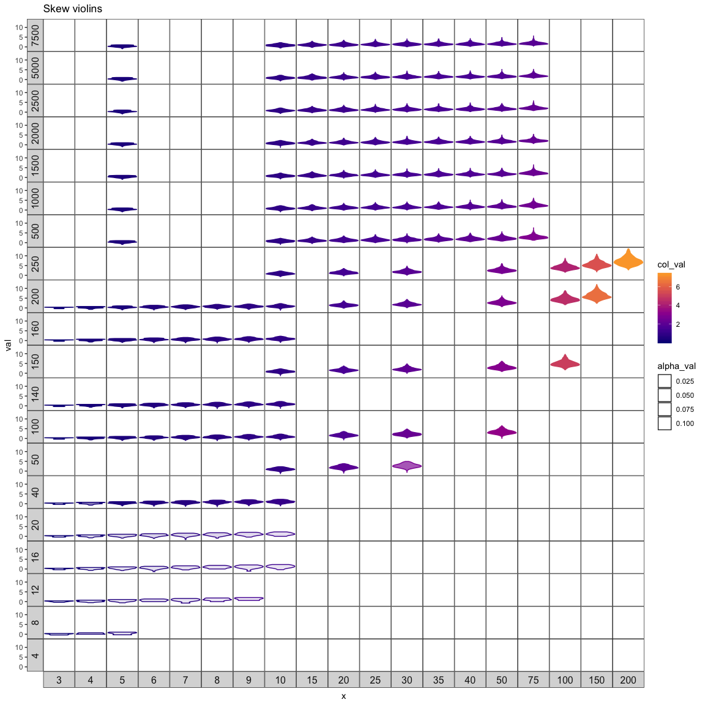
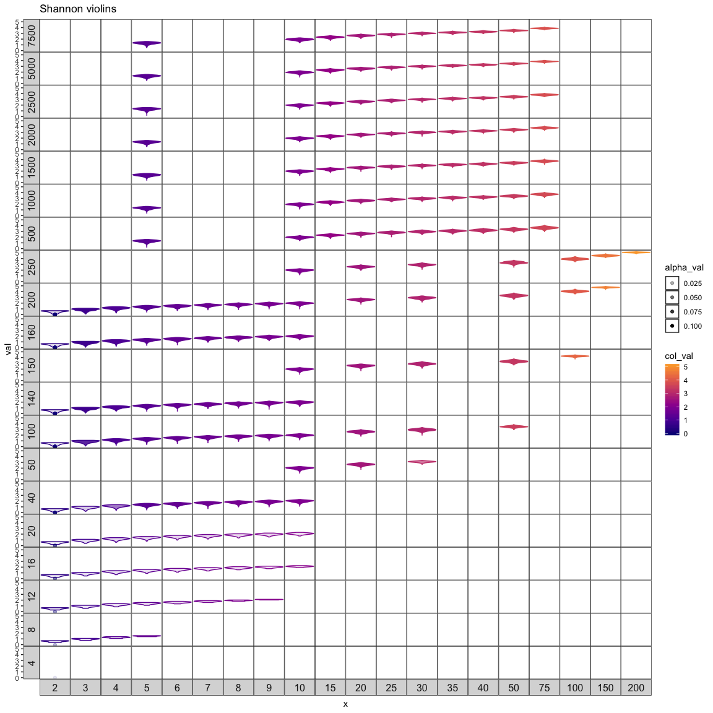
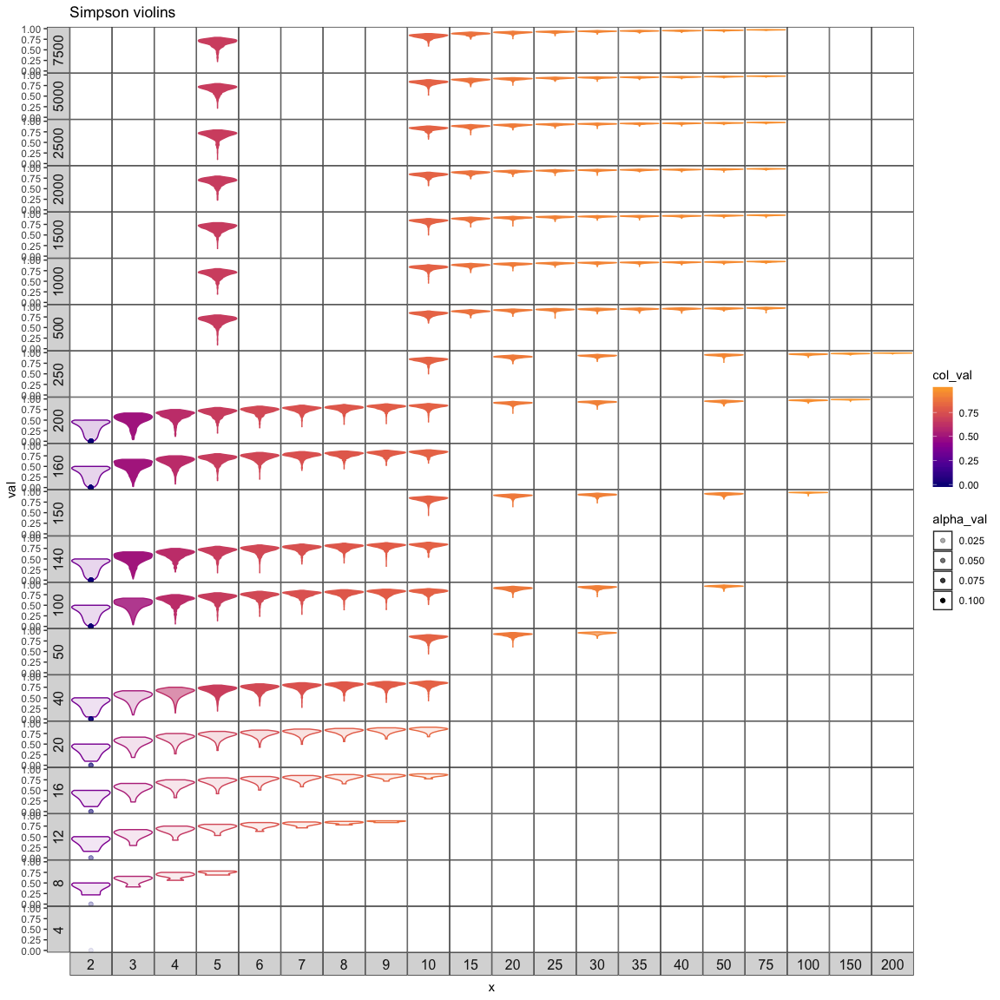

Exploring S and N space
================
10/8/2019

Combinations of S & N
---------------------

These are the combinations of S and N I ran sampling on. There are three chunks: small, large S, and large N. Small is to get at behavior for very small S and N. Large S and large N explore larger communities in those directions. The bottom right corner is gently constrained because N must be &gt;= to S. I tried to explore the general regions of space filled by the datasets in the Baldridge/White papers. I've done this edges-approach because is computationally expensive to explore the large S-large N corner, and there aren't datasets there.

Number of unique elements (out of 10,000 draws)
-----------------------------------------------

I've drawn 10,000 times from the feasible set for each of these S-N combinations. For some of them, we won't be able to get 10,000 unique elements from the feasible set because the FS is in fact much smaller than that.

Shapes represented - violins
----------------------------

Generally, for the small combinations, it looks like

-   the mean value of whatever index increases with increasing S (2:10)
-   the lower tail of the index gets longer with increasing N (4:200)
-   the tails taper more sharply for Shannon & Simpson than for skewness
-   Skewness seems to behave a little counterintuitively. It appears to *increase* with increasing S; very low S has near-0 skewness. For a given S, the mean skewness decreases with increasing N, and the tail gets longer. Within the scope of strictly increasing RADs, *the larger the skewness, the longer the rare tail in the SAD*.

