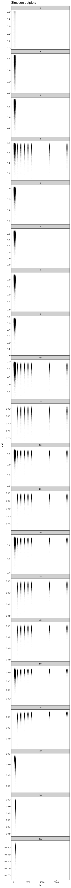
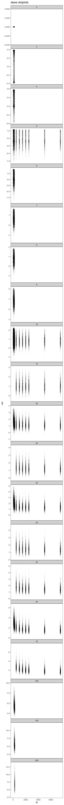

Exploring S and N space
================
10/8/2019

Combinations of S & N
---------------------

These are the combinations of S and N I ran sampling on. There are three chunks: small, large S, and large N. Small is to get at behavior for very small S and N. Large S and large N explore larger communities in those directions. The bottom right corner is gently constrained because N must be &gt;= to S. I tried to explore the general regions of space filled by the datasets in the Baldridge/White papers. I've done this edges-approach because is computationally expensive to explore the large S-large N corner, and there aren't datasets there.

Number of unique elements (out of 10,000 draws)
-----------------------------------------------

I've drawn 10,000 times from the feasible set for each of these S-N combinations. For some of them, we won't be able to get 10,000 unique elements from the feasible set because the FS is in fact much smaller than that.

Shapes represented - violins
----------------------------

Generally, for the small combinations, it looks like

-   the mean value of whatever index increases with increasing S (2:10)
-   the lower tail of the index gets longer with increasing N (4:200)
-   the tails taper more sharply for Shannon & Simpson than for skewness
-   Skewness seems to behave a little counterintuitively. It appears to *increase* with increasing S; very low S has near-0 skewness. For a given S, the mean skewness decreases with increasing N, and the tail gets longer. Within the scope of strictly increasing RADs, *the larger the skewness, the longer the rare tail in the SAD*.

    ## Warning: Removed 23 rows containing missing values (geom_point).

Q: Why, for a given number of species, does adding individuals increase diversity and decrease skewness? A: The diversity indices are definitely sensitive to N. I'm not sure about skewness.

Heatmaps
--------

The most skewed - by a lot - panel appears to be S = 200, N = 250. Zooming in on that one....

After staring at these.

1.  Shannon is irritating because it contains infromation about both richness and diversity; across large gradients in S, it becomes very difficult to understand how changes in the distribution of Shannon values reflects a) changing shapses and b)just the change in S.
2.  Skewness tells you something about how far to the right the J is. If you have a lot of extra individuals to smudge over few species, you can achieve relatively low skewness values vs. when S approaches N, and you can only have a few FS and they all have the J pretty far to the right. This is why the only really high skew values are in the large S plots, as S approaches N.
3.  Simpson is tracking a combination of how far rigth and how *tall* the J is. More individuals gives you higher Simpson values (generallly), because they create the capacity for really tall J's. But adding species *also* increases the simpson's values, I think because they remove the Js that are tall, yes, but also have more elements where the excess N are smudged over more of the species. For an N, increasing S hollows out the upper left/inner elbow of the J.
4.  The overall takeaways are...
    1.  Shannon's is a mind trip and not super helpful.
    2.  Simpson's and skewness tell us different things; they're neither completely orthogonal nor completely correlated.
    3.  The underlying statistical constraint's shape is contingent on S and N and their ratio; we expect some S and N to have more or less skewed/even/diverse distributions. There is not an obvious rule-of-thumb to make generalizations about how different combinations of S and N will compare without sampling (or more staring at these plots). However, the feasible set is always dominated by hollow curves.
    4.  Generally, I think it is better practice to compare an empirical SAD to its corresponding FS, and to draw our conclusions from how extreme or pedestrian the observed SAD is compared to its FS - than to try and glean too much about how the constraint envelope shifts with changing S and N. (.... writ large. I think it's still important to dig into how changing the number of cryptic rare species present would change the percentile values. But, importantly, that's not talking about driving S all the way up to equal a fixed N. That's about adding a couple of species with one individual each, increasing S and N simultaneously.).
    5.  Running up against small-FS-problems is confined to the very smallest communities.
